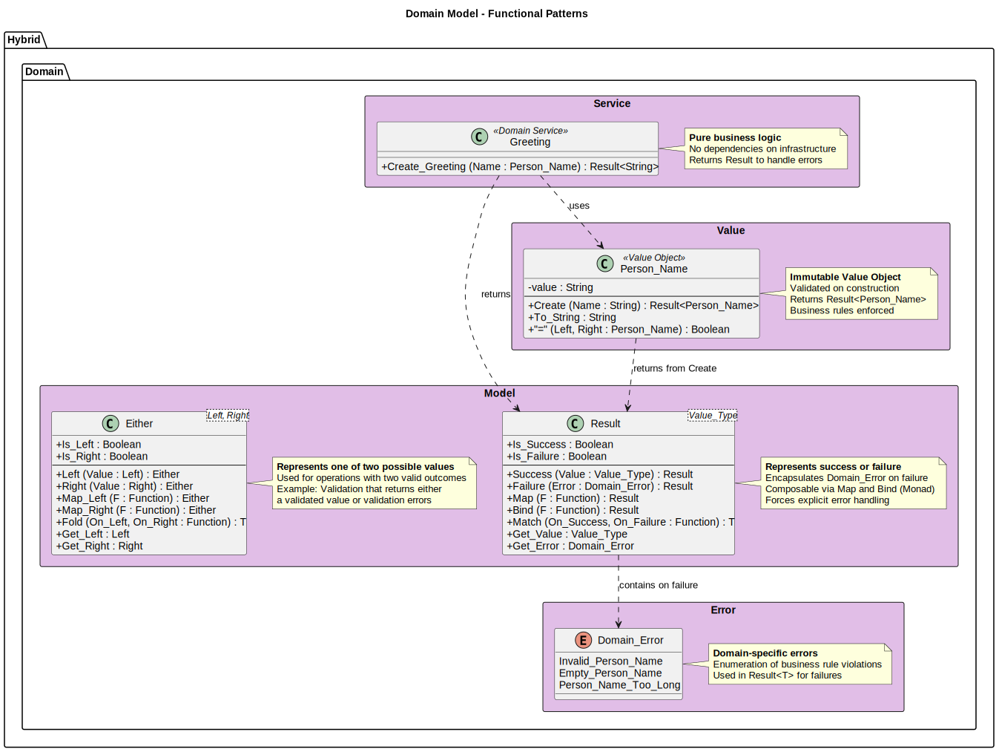
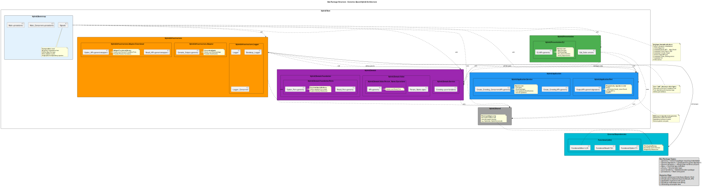
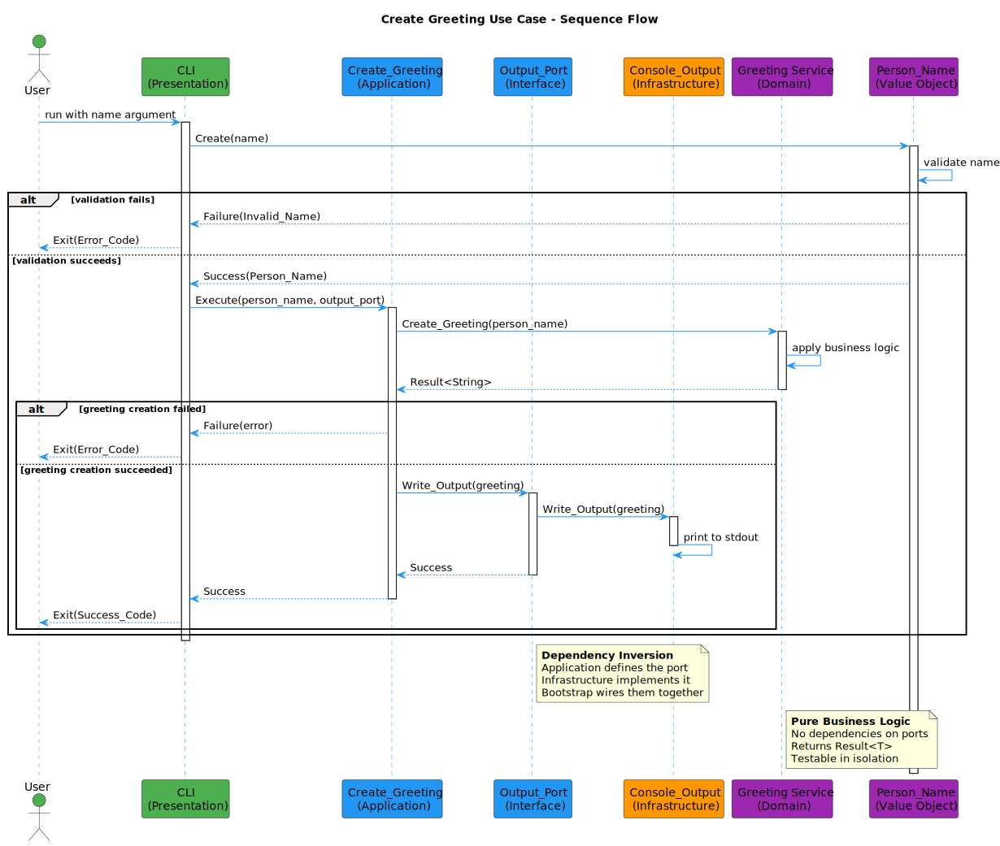

# Hybrid Architecture Guide

**Version:** 1.0.0  
**Date:** October 28, 2025  
**SPDX-License-Identifier:** BSD-3-Clause
**License File:** See LICENSE file in the project root.
**Copyright:** © 2025 Michael Gardner, A Bit of Help, Inc.  
**Status:** Released  
This guide explains the architectural principles behind this template and how Domain-Driven Design (DDD), Clean Architecture, Hexagonal Architecture, and the Dependency Inversion Principle (DIP) work together to create a maintainable, testable, and scalable application.

## Table of Contents

1. [Overview](#overview)
2. [Core Principles](#core-principles)
3. [Domain-Driven Design (DDD)](#domain-driven-design-ddd)
4. [Clean Architecture](#clean-architecture)
5. [Hexagonal Architecture](#hexagonal-architecture)
6. [Dependency Inversion Principle (DIP)](#dependency-inversion-principle-dip)
7. [How They Work Together](#how-they-work-together)
8. [Practical Implementation](#practical-implementation)
9. [Common Scenarios](#common-scenarios)
10. [Best Practices](#best-practices)

## Overview

This template combines four powerful architectural patterns to create a robust foundation for Kotlin applications:

- **Domain-Driven Design (DDD)**: Focuses on modeling the business domain
- **Clean Architecture**: Ensures separation of concerns and testability
- **Hexagonal Architecture**: Isolates business logic from external systems
- **Dependency Inversion Principle (DIP)**: Ensures dependencies point inward


## Core Principles

### 1. Business Logic First
The core of your application is the business logic, not the framework or database. Everything else is a detail that can be changed without affecting the business rules.

### 2. Dependencies Point Inward
Outer layers depend on inner layers, never the reverse. This creates a stable core that doesn't change when external details change.

### 3. Abstractions Over Implementations
Depend on interfaces (abstractions) rather than concrete classes. This allows for flexibility and testability.

### 4. Isolated Layers
Each layer has specific responsibilities and communicates with other layers through well-defined interfaces.

## Domain-Driven Design (DDD)

DDD is about understanding and modeling the business domain. It provides patterns and practices for capturing business complexity in code.

### Key Concepts

#### Entities
Objects with a distinct identity that persists over time.

```kotlin
// domain/src/main/kotlin/com/abitofhelp/hybrid/domain/model/Order.kt
class Order(
    val id: OrderId,  // Unique identity
    val customerId: CustomerId,
    private val items: MutableList<OrderItem> = mutableListOf(),
    var status: OrderStatus = OrderStatus.DRAFT
) {
    fun addItem(product: Product, quantity: Int): Either<DomainError, OrderItemAdded> {
        // Business logic here
    }
    
    fun submit(): Either<DomainError, OrderSubmitted> {
        // More business logic
    }
}
```

#### Value Objects
Immutable objects that are defined by their attributes rather than identity.

```kotlin
// domain/src/main/kotlin/com/abitofhelp/hybrid/domain/value/Email.kt
data class Email private constructor(val value: String) {
    companion object {
        fun create(value: String): Either<ValidationError, Email> = either {
            ensure(value.contains("@")) { 
                ValidationError("email", "Invalid email format") 
            }
            Email(value)
        }
    }
}
```

#### Domain Services
Operations that don't naturally fit within an entity or value object.

```kotlin
// domain/src/main/kotlin/com/abitofhelp/hybrid/domain/service/PricingService.kt
class PricingService {
    fun calculateOrderTotal(
        order: Order,
        customer: Customer
    ): Either<DomainError, Money> = either {
        val subtotal = order.items.sumOf { it.price * it.quantity }
        val discount = calculateCustomerDiscount(customer, subtotal)
        Money(subtotal - discount)
    }
}
```

#### Repository Interfaces
Abstractions for data persistence (defined in domain, implemented in infrastructure).

```kotlin
// domain/src/main/kotlin/com/abitofhelp/hybrid/domain/repository/CustomerRepository.kt
interface CustomerRepository {
    suspend fun findById(id: CustomerId): Either<DomainError, Customer?>
    suspend fun save(customer: Customer): Either<DomainError, Customer>
    suspend fun findByEmail(email: Email): Either<DomainError, Customer?>
}
```

### DDD in This Template

The domain layer (`domain/`) contains all business logic:
- Models (entities and aggregates)
- Value objects
- Domain services
- Repository interfaces
- Domain events
- Domain errors



## Clean Architecture

Clean Architecture organizes code into concentric layers, with business logic at the center and implementation details on the outside.

### The Layers


#### 1. Domain Layer (Center)
- Contains enterprise business rules
- No dependencies on other layers
- Pure Kotlin code

#### 2. Application Layer
- Contains application-specific business rules
- Orchestrates the domain layer
- Defines use cases

```kotlin
// application/src/main/kotlin/com/abitofhelp/hybrid/application/usecase/CreateOrderUseCase.kt
class CreateOrderUseCase(
    private val customerRepository: CustomerRepository,
    private val productRepository: ProductRepository,
    private val orderRepository: OrderRepository,
    private val paymentService: PaymentServicePort,
    private val eventPublisher: EventPublisherPort
) {
    suspend fun execute(command: CreateOrderCommand): Either<ApplicationError, OrderDto> = either {
        // Validate customer exists
        val customer = customerRepository.findById(command.customerId)
            .bind()
            ?: raise(ApplicationError.NotFound("Customer", command.customerId))
            
        // Create order
        val order = Order.create(customer.id).bind()
        
        // Add items
        command.items.forEach { item ->
            val product = productRepository.findById(item.productId).bind()
                ?: raise(ApplicationError.NotFound("Product", item.productId))
            order.addItem(product, item.quantity).bind()
        }
        
        // Process payment
        val payment = paymentService.processPayment(
            order.calculateTotal(),
            command.paymentDetails
        ).bind()
        
        // Save order
        val savedOrder = orderRepository.save(order).bind()
        
        // Publish event
        eventPublisher.publish(
            OrderCreatedEvent(savedOrder.id, customer.id, Instant.now())
        ).bind()
        
        // Map to DTO
        OrderMapper.toDto(savedOrder)
    }
}
```

#### 3. Infrastructure Layer
- Implements technical details
- Database access, external APIs, file systems
- Implements interfaces defined in inner layers

```kotlin
// infrastructure/src/main/kotlin/com/abitofhelp/hybrid/infrastructure/adapter/persistence/JpaCustomerRepository.kt
@Repository
class JpaCustomerRepository(
    private val jpaRepository: CustomerJpaRepository
) : CustomerRepository {
    override suspend fun findById(id: CustomerId): Either<DomainError, Customer?> = either {
        val entity = jpaRepository.findByIdOrNull(id.value)
        entity?.let { CustomerMapper.toDomain(it) }
    }
    
    override suspend fun save(customer: Customer): Either<DomainError, Customer> = either {
        val entity = CustomerMapper.toEntity(customer)
        val saved = jpaRepository.save(entity)
        CustomerMapper.toDomain(saved)
    }
}
```

#### 4. Presentation Layer
- User interface (REST, GraphQL, CLI, Web)
- Handles user input and displays output
- Depends only on the application layer

```kotlin
// presentation/src/main/kotlin/com/abitofhelp/hybrid/presentation/api/rest/OrderController.kt
@RestController
@RequestMapping("/api/v1/orders")
class OrderController(
    private val createOrderUseCase: CreateOrderUseCase,
    private val getOrderUseCase: GetOrderUseCase
) {
    @PostMapping
    suspend fun createOrder(
        @Valid @RequestBody request: CreateOrderRequest
    ): ResponseEntity<OrderResponse> {
        val command = RequestMapper.toCommand(request)
        
        return createOrderUseCase.execute(command)
            .fold(
                { error -> ResponseEntity.badRequest().body(ErrorResponse.from(error)) },
                { order -> ResponseEntity.ok(ResponseMapper.toResponse(order)) }
            )
    }
}
```

### Dependency Rule

The most important rule in Clean Architecture: **dependencies only point inward**.

- Domain layer has no dependencies
- Application layer depends only on Domain
- Infrastructure depends on Domain and Application
- Presentation depends only on Application

This ensures that business logic is isolated and can be tested independently.

## Hexagonal Architecture

Also known as Ports and Adapters, this architecture pattern isolates the application core from external concerns.


### Ports

Interfaces that define how the application interacts with the outside world.

#### Input Ports (Driving)
Define operations the application provides:

```kotlin
// application/src/main/kotlin/com/abitofhelp/hybrid/application/port/input/CreateOrderPort.kt
interface CreateOrderPort {
    suspend fun createOrder(command: CreateOrderCommand): Either<ApplicationError, OrderDto>
}
```

#### Output Ports (Driven)
Define operations the application needs from external systems:

```kotlin
// application/src/main/kotlin/com/abitofhelp/hybrid/application/port/output/PaymentServicePort.kt
interface PaymentServicePort {
    suspend fun processPayment(
        amount: Money,
        paymentDetails: PaymentDetails
    ): Either<PaymentError, PaymentResult>
}
```

### Adapters

Implementations that connect the ports to external systems.

#### Primary Adapters (Driving)
Adapt external inputs to application ports:

```kotlin
// presentation/src/main/kotlin/com/abitofhelp/hybrid/presentation/api/rest/OrderController.kt
@RestController
class OrderController(private val createOrderPort: CreateOrderPort) {
    @PostMapping("/orders")
    suspend fun createOrder(@RequestBody request: CreateOrderRequest): OrderResponse {
        val command = request.toCommand()
        return createOrderPort.createOrder(command)
            .fold(
                { error -> throw ApiException(error) },
                { order -> OrderResponse.from(order) }
            )
    }
}
```

#### Secondary Adapters (Driven)
Implement output ports for external systems:

```kotlin
// infrastructure/src/main/kotlin/com/abitofhelp/hybrid/infrastructure/adapter/payment/StripePaymentAdapter.kt
@Component
class StripePaymentAdapter(
    private val stripeClient: StripeClient
) : PaymentServicePort {
    override suspend fun processPayment(
        amount: Money,
        paymentDetails: PaymentDetails
    ): Either<PaymentError, PaymentResult> = either {
        val charge = stripeClient.createCharge(
            amount = amount.toStripeAmount(),
            currency = amount.currency.code,
            source = paymentDetails.token
        )
        
        PaymentResult(
            transactionId = charge.id,
            status = PaymentStatus.COMPLETED
        )
    }
}
```

### Benefits

1. **Testability**: Easy to test by providing mock adapters
2. **Flexibility**: Change external systems without touching business logic
3. **Clear boundaries**: Explicit interfaces between layers

## Dependency Inversion Principle (DIP)

DIP states that high-level modules should not depend on low-level modules; both should depend on abstractions.

### Without DIP (Bad)

```kotlin
// Domain layer depending on infrastructure - BAD!
class OrderService(
    private val mysqlDatabase: MySQLDatabase  // Concrete dependency
) {
    fun createOrder(order: Order) {
        mysqlDatabase.insert("orders", order)  // Tied to specific database
    }
}
```

### With DIP (Good)

```kotlin
// Domain layer defines the interface
interface OrderRepository {
    suspend fun save(order: Order): Either<DomainError, Order>
}

// Domain service depends on abstraction
class OrderService(
    private val orderRepository: OrderRepository  // Abstract dependency
) {
    suspend fun createOrder(order: Order): Either<DomainError, Order> {
        return orderRepository.save(order)  // Not tied to any specific database
    }
}

// Infrastructure provides the implementation
@Repository
class JpaOrderRepository : OrderRepository {
    override suspend fun save(order: Order): Either<DomainError, Order> {
        // JPA-specific implementation
    }
}
```

### DIP in This Template

1. **Repository Pattern**: Domain defines interfaces, infrastructure implements them
2. **Port Interfaces**: Application defines what it needs, infrastructure provides it
3. **Dependency Injection**: Wire concrete implementations at runtime

```kotlin
// Application defines what it needs
interface EventPublisherPort {
    suspend fun publish(event: DomainEvent): Either<ApplicationError, Unit>
}

// Infrastructure provides multiple implementations
@Component
@Profile("kafka")
class KafkaEventPublisher : EventPublisherPort { /* ... */ }

@Component
@Profile("rabbitmq")
class RabbitMQEventPublisher : EventPublisherPort { /* ... */ }

@Component
@Profile("test")
class InMemoryEventPublisher : EventPublisherPort { /* ... */ }
```

## How They Work Together



### 1. DDD + Clean Architecture
- DDD provides the tactical patterns for the domain layer
- Clean Architecture provides the overall structure
- Domain entities and services live in the center

### 2. Clean + Hexagonal
- Clean Architecture's dependency rule aligns with Hexagonal's port direction
- Application layer contains use cases and port definitions
- Infrastructure layer contains adapters

### 3. DIP Everywhere
- All dependencies point toward abstractions
- Concrete implementations are injected at runtime
- Easy to swap implementations for testing or different environments

### Example Flow



1. **REST Controller** (Presentation/Primary Adapter) receives HTTP request
2. **CreateOrderUseCase** (Application/Use Case) orchestrates the business flow
3. **Order** (Domain/Entity) enforces business rules
4. **CustomerRepository** (Domain/Port) defines data access interface
5. **JpaCustomerRepository** (Infrastructure/Secondary Adapter) implements data access
6. **PaymentServicePort** (Application/Port) defines payment interface
7. **StripeAdapter** (Infrastructure/Secondary Adapter) processes payment
8. **EventPublisherPort** (Application/Port) defines event publishing
9. **KafkaAdapter** (Infrastructure/Secondary Adapter) publishes to Kafka

## Practical Implementation

### Module Structure

```
hybrid_architecture_template/
├── domain/                 # Core business logic (DDD)
│   ├── model/             # Entities and aggregates
│   ├── value/             # Value objects
│   ├── service/           # Domain services
│   ├── repository/        # Repository interfaces
│   ├── event/             # Domain events
│   └── error/             # Domain errors
│
├── application/           # Use cases and orchestration
│   ├── usecase/          # Application services
│   ├── port/             # Port interfaces
│   │   ├── input/        # Driving ports
│   │   └── output/       # Driven ports
│   ├── dto/              # Data transfer objects
│   └── mapper/           # Domain-DTO mappers
│
├── infrastructure/        # Technical implementations
│   ├── adapter/          # Port implementations
│   │   ├── persistence/  # Database adapters
│   │   ├── external/     # External API adapters
│   │   └── messaging/    # Message queue adapters
│   └── config/           # Framework configuration
│
└── presentation/         # User interfaces
    ├── api/             # REST, GraphQL endpoints
    ├── cli/             # Command-line interface
    └── web/             # Web UI controllers
```

### Creating a New Feature

1. **Start with the Domain**
   ```kotlin
   // Define the business concept
   data class Product(
       val id: ProductId,
       val name: ProductName,
       val price: Money,
       val stock: Stock
   )
   ```

2. **Define Repository Interface**
   ```kotlin
   interface ProductRepository {
       suspend fun findById(id: ProductId): Either<DomainError, Product?>
       suspend fun save(product: Product): Either<DomainError, Product>
   }
   ```

3. **Create Use Case**
   ```kotlin
   class CreateProductUseCase(
       private val productRepository: ProductRepository
   ) {
       suspend fun execute(command: CreateProductCommand): Either<ApplicationError, ProductDto> = either {
           val product = Product.create(
               name = command.name,
               price = command.price,
               stock = command.initialStock
           ).bind()
           
           val saved = productRepository.save(product).bind()
           ProductMapper.toDto(saved)
       }
   }
   ```

4. **Implement Repository**
   ```kotlin
   @Repository
   class JpaProductRepository(
       private val jpaRepository: ProductJpaRepository
   ) : ProductRepository {
       override suspend fun save(product: Product): Either<DomainError, Product> = either {
           val entity = ProductMapper.toEntity(product)
           val saved = jpaRepository.save(entity)
           ProductMapper.toDomain(saved)
       }
   }
   ```

5. **Create REST Endpoint**
   ```kotlin
   @RestController
   @RequestMapping("/api/products")
   class ProductController(
       private val createProductUseCase: CreateProductUseCase
   ) {
       @PostMapping
       suspend fun createProduct(
           @RequestBody request: CreateProductRequest
       ): ResponseEntity<ProductResponse> {
           return createProductUseCase.execute(request.toCommand())
               .fold(
                   { error -> ResponseEntity.badRequest().body(error.toResponse()) },
                   { product -> ResponseEntity.ok(product.toResponse()) }
               )
       }
   }
   ```

## Common Scenarios

### Handling External Service Failures

```kotlin
// Define resilient port
interface EmailServicePort {
    suspend fun sendEmail(email: Email): Either<EmailError, Unit>
}

// Implement with retry logic
@Component
class SendGridEmailAdapter(
    private val sendGridClient: SendGridClient
) : EmailServicePort {
    override suspend fun sendEmail(email: Email): Either<EmailError, Unit> = either {
        retry(times = 3, initialDelay = 100.milliseconds) {
            sendGridClient.send(email.toSendGridMail())
        }.mapLeft { 
            EmailError.ServiceUnavailable("Failed to send email after 3 attempts") 
        }.bind()
    }
}
```

### Testing with Mock Adapters

```kotlin
class CreateOrderUseCaseTest {
    // Mock repositories
    private val customerRepository = mockk<CustomerRepository>()
    private val orderRepository = mockk<OrderRepository>()
    private val paymentService = mockk<PaymentServicePort>()
    
    private val useCase = CreateOrderUseCase(
        customerRepository,
        orderRepository,
        paymentService
    )
    
    @Test
    fun `should create order successfully`() = runTest {
        // Given
        val customer = Customer(/* ... */)
        val command = CreateOrderCommand(/* ... */)
        
        coEvery { customerRepository.findById(any()) } returns customer.right()
        coEvery { orderRepository.save(any()) } returns order.right()
        coEvery { paymentService.processPayment(any(), any()) } returns paymentResult.right()
        
        // When
        val result = useCase.execute(command)
        
        // Then
        result.shouldBeRight()
    }
}
```

### Switching Databases

```kotlin
// Original MongoDB implementation
@Component
@Profile("mongodb")
class MongoOrderRepository : OrderRepository {
    override suspend fun save(order: Order): Either<DomainError, Order> {
        // MongoDB implementation
    }
}

// New PostgreSQL implementation
@Component
@Profile("postgresql")
class PostgresOrderRepository : OrderRepository {
    override suspend fun save(order: Order): Either<DomainError, Order> {
        // PostgreSQL implementation
    }
}

// No changes needed in domain or application layers!
```

## Best Practices

### 1. Start with the Domain
Always model your domain first. Don't think about databases or frameworks until you understand the business problem.

### 2. Keep Layers Pure
- Domain layer: Only business logic, no technical concerns
- Application layer: Only orchestration, no business rules
- Infrastructure: Only technical implementations
- Presentation: Only user interface concerns

### 3. Use Explicit Error Handling
```kotlin
sealed class DomainError {
    data class ValidationError(val field: String, val message: String) : DomainError()
    data class BusinessRuleViolation(val rule: String, val reason: String) : DomainError()
    data class NotFound(val entity: String, val id: String) : DomainError()
}
```

### 4. Make Invalid States Unrepresentable
```kotlin
// Bad: Order can be in invalid state
class Order {
    var status: String = ""  // Could be any string!
    var items: List<OrderItem>? = null  // Could be null!
}

// Good: Order is always valid
class Order private constructor(
    val id: OrderId,
    val items: NonEmptyList<OrderItem>,
    val status: OrderStatus  // Sealed class with valid states only
) {
    companion object {
        fun create(items: List<OrderItem>): Either<DomainError, Order> = either {
            ensure(items.isNotEmpty()) { 
                DomainError.ValidationError("items", "Order must have at least one item") 
            }
            Order(
                id = OrderId.generate(),
                items = NonEmptyList.fromListUnsafe(items),
                status = OrderStatus.Draft
            )
        }
    }
}
```

### 5. Test at the Right Level
- **Domain**: Unit tests for business logic
- **Application**: Integration tests for use cases
- **Infrastructure**: Contract tests for adapters
- **Presentation**: API tests for endpoints

### 6. Use Dependency Injection Wisely
```kotlin
// Configure dependencies at the application boundary
@Configuration
class ApplicationConfiguration {
    @Bean
    fun createOrderUseCase(
        customerRepository: CustomerRepository,
        orderRepository: OrderRepository,
        paymentService: PaymentServicePort,
        eventPublisher: EventPublisherPort
    ) = CreateOrderUseCase(
        customerRepository,
        orderRepository,
        paymentService,
        eventPublisher
    )
}
```

## Summary

This hybrid architecture combines the best of four proven patterns:

1. **DDD** provides rich domain modeling
2. **Clean Architecture** ensures proper layering and dependencies
3. **Hexagonal Architecture** isolates business logic from technical details
4. **DIP** enables flexibility and testability

Together, they create a system that is:
- **Maintainable**: Clear structure and separation of concerns
- **Testable**: Easy to test at every level
- **Flexible**: Easy to change technical implementations
- **Scalable**: Can grow with your business needs

The key is to always respect the dependency rule: dependencies point inward, and the domain is sacred. With this foundation, you can build applications that stand the test of time and changing requirements.